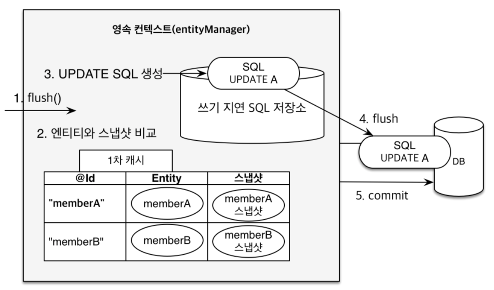

# Section 2: JPA 시작하기

기본 type 과 setting
```java
EntityManagerFactory emf = Persistence.createEntityManagerFactory("hello");
EntityManager em = emf.createEntityManager();
// open transaction
EntityTransaction tx = em.getTransaction();
tx.begin();
try {
    Member member = new Member();
    member.setId(2L);
    member.setName("asd");
    em.persist(member);

    tx.commit();
} catch (Exception e) {
    tx.rollback();
} finally {
    em.close();
}
emf.close();
```

변경 저장
```java
Member m = em.find(Member.class, 2L);
m.setName("changedName"); // doesn't have to em.persist (persistence context)

tx.commit();
```

JPQL
```java
List<Member> res = em.createQuery("select m from Member as m", Member.class)
                    .getResultList();
res.forEach(m -> System.out.println(m.getName()));
```

# Section 3: 영속성 관리



