목차

Section 2: JPA 시작하기
- entity manager factory와 entity manager

Section 3: 영속성 관리
- 영속성 컨텍스트 구조와 동작

Section 4: 엔티티 매핑
- 엔티티 어노테이션과 기본 필드 어노테이션
- 기본 키 매핑 전략 4가지(identity, sequence, table, auto)

Section 5: 연관관계 매핑 기초
- 단방향 매핑
- 양방향 매핑 (mappedBy)

Section 6: 연관관계 매핑의 종류
- @ManyToOne
- @OneToMany
- @OneToOne
- @ManyToMany

Section 7: 고급 매핑
- 상속관계 매핑 3가지 (조인, 단일 테이블, 클래스마다 테이블)
- @MappedSuperclass

Section 8: 프록시와 연관관계 관리
- 프록시와 지연로딩
- CASCADE 와 orphanRemoval

Section 9: 값 타입
- 임베디드 타입
- 컬렉션 값 타입


# Section 2: JPA 시작하기

기본 type 과 setting
```java
EntityManagerFactory emf = Persistence.createEntityManagerFactory("hello");
EntityManager em = emf.createEntityManager();
// open transaction
EntityTransaction tx = em.getTransaction();
tx.begin();
try {
    Member member = new Member();
    member.setId(2L);
    member.setName("asd");
    em.persist(member);

    tx.commit();
} catch (Exception e) {
    tx.rollback();
} finally {
    em.close();
}
emf.close();
```

변경 저장
```java
Member m = em.find(Member.class, 2L);
m.setName("changedName"); // doesn't have to em.persist (persistence context)

tx.commit();
```

JPQL
```java
List<Member> res = em.createQuery("select m from Member as m", Member.class)
                    .getResultList();
res.forEach(m -> System.out.println(m.getName()));
```

# Section 3: 영속성 관리

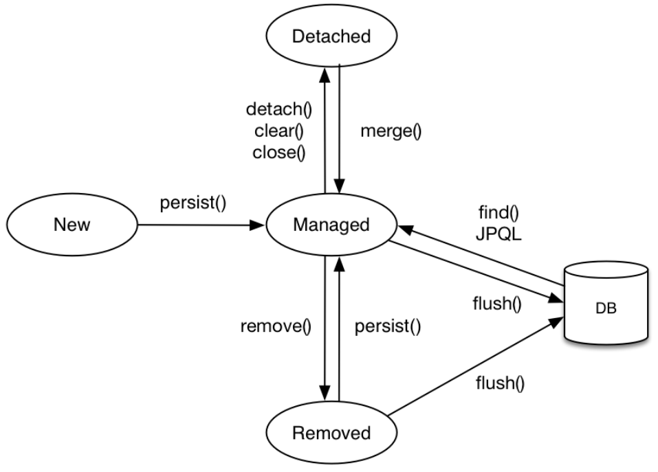

- 비영속(new/transient): 영속성 컨텍스트와 관련 없음
- 영속(managed): 영속성 컨텍스트에 관리되는 상태 (`em.persist(member);`)
- 준영속(detached): 영속성 컨텍스트에 저장되었다가 분리된 상태 (`em.detach(member);`) => db 반영 안하고 객체만 변경하기 위함
- 삭제(removed): 삭제된 상태 (`em.remove(member);`)

조회 쿼리는 1차 캐시에서 받거나 없으면 db에서 받아온다. 업데이트 쿼리는 commit 하고 나서 한번에 날라간다.

```java
em.persist(memberA);
```

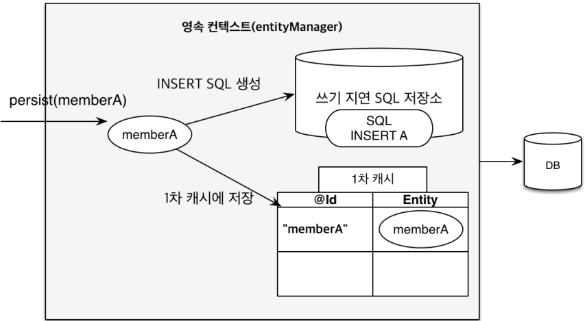

```java
tx.commit(); // this makes em.flush
```

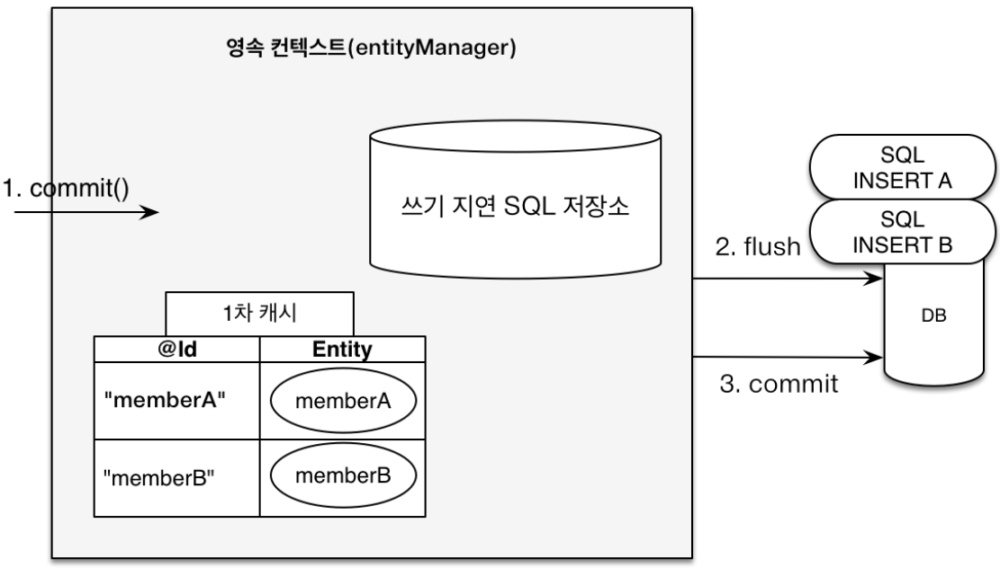

```java
em.flush();
```

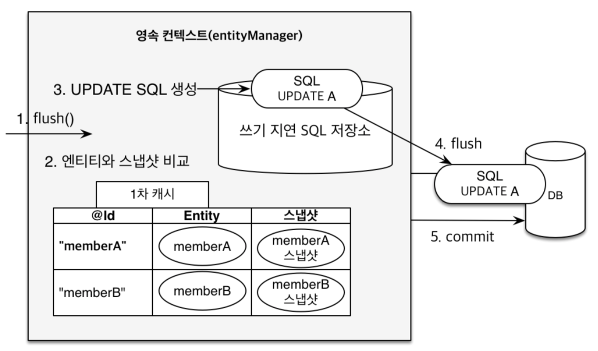

이에 따라 새로 객체를 만들지 않는 이상(즉, persistence context에서 관리되는 객체라면) `em.persist`를 할 필요가 없다. 쿼리는 다음 3가지 경우에 날라간다.
- `em.flush();` <= 영속성 컨텍스트를 비우지 않는다.
- `tx.commit();`
- JPQL 쿼리 실행


영속성 컨텍스트를 사용함으로서 다음의 장점이 있다.
- 1차 캐시
- 동일성(identity) 보장 (쿼리가 달라도, 같은 record에 대해 결과값 메모리 값이 같다.)
- 트랜잭션을 지원하는 쓰기 지연 (transactional write-behind)
- 변경 감지(dirty checking)
- 지연 로딩(lazy loading)

### 동일성 보장에 대해

쿼리 달라도 됨. 레코드가 같으면 메모리 같음.

```java
List<Member> res = em.createQuery("select m from Member as m where m.name like concat(:k1, '%')", Member.class)
        .setParameter("k1", "test")
        .getResultList();
List<Member> res2 = em.createQuery("select m from Member as m where m.id = 1", Member.class)
        .getResultList();
res.forEach(m -> {
    System.out.println(m.getName());
    if (m.getId() == 1) {
        System.out.println("Are the same = " + (m == res2.get(0))); // true
    }
});
```

# Section 4: 엔티티 매핑

- `@Entity`

JPA가 관리하는 객체이다. 기본 생성자가 필요하다. 
`name` parameter는 JPA에서 사용되는 엔티티 이름이다. 기본값은 클래스 이름과 같다.

- `@Table`

엔티티와 매핑할 테이블을 지정한다.
`name` parameter는 매핑할 테이블 이름이다. 기본값은 엔티티 이름이다. 
`catalog` parameter는 데이터베이스 catalog를 매핑한다.
`schema` parameter는 데이터베이스 schema를 매핑한다.
`uniqueConstraints` parameter는 DDL 생성 시에 유니크 제약 조건을 생성한다.

- `@Column`

필드와 컬럼을 매핑한다. 제약조건을 추가할 수 있다. 단, 제약조건은 ddl 생성 시에만 적용되며 application 로직에는 반영되지 않는다.  

- `hibernate.hbm2ddl.auto`

create(drop->create) / create-drop(drop->create->drop) / update(필드 삭제는 안먹음) / validate(확인기능) / none

ddl: 데이터베이스 구조 정의에 사용하는 언어. 생성된 ddl은 운영에서 사용하지 않거나 다듬어 사용해야 한다.

**주의** : 개발 초기에 create/update, 테스트 서버에서 update/validate, 스테이징과 운영은 validate/none

### 필드 매핑 annotation 들

```java
@Id
private Long id;
private String name;
private Integer age;
@Enumerated(EnumType.STRING) // enum
private RoleType roleType;
@Temporal(TemporalType.TIMESTAMP) // 날짜
private Date createDate;
@Temporal(TemporalType.TIMESTAMP) // 날짜
private Date lastModifiedDate;
@Lob // BLOB, CLOB
private String description;
@Transient // 매핑 무시
private int notField;
private LocalDate testLocalDate; // Temporal 안써도 됨
private LocalDateTime testLocalDateTime; // Temporal 안써도 됨
```
위 상태에서 ddl create시:
```sql
create table Member (
    age integer,
    testLocalDate date,
    createDate timestamp(6),
    id bigint not null,
    lastModifiedDate timestamp(6),
    testLocalDateTime timestamp(6),
    name varchar(255),
    roleType varchar(255) check (roleType in ('NORMAL','VIP')),
    description clob,
    primary key (id)
)
```

#### @Column

왠만하면 `name` 직접 적어놓자. spring boot 관례랑 회사 관례랑 다를 수도 있다.

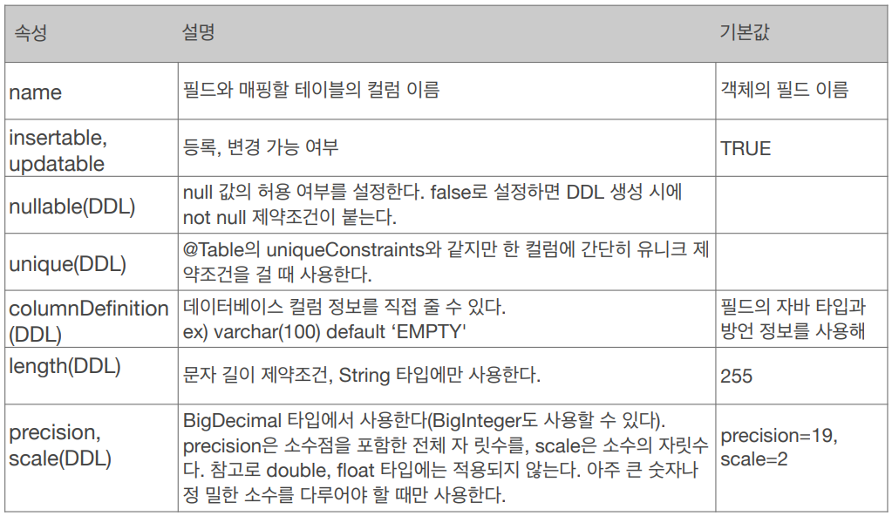

#### @Enumerated

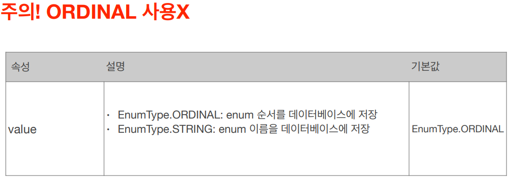

#### @Temporal

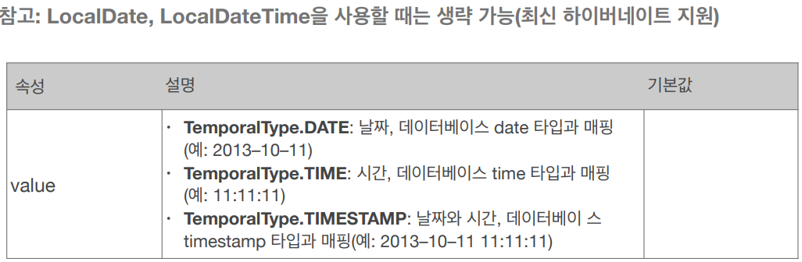

#### @Lob

지정할 수 있는 속성이 없다. 매핑하는 필드 타입이 문자면 CLOB 매핑, 나머지는 BLOB 매핑.

#### @Transient

데이터베이스에 저장 및 조회 안됨. 주로 메모리상에서만 임시로 어떤 값을 보관하고 싶을 때 사용한다.


### 기본 키 매핑

직접 할당하려면 `@Id` 만 사용한다. 주로 자동 생성하기에 `@GeneratedValue`를 함께 사용한다. 여기서 `strategy` parameter를 지정한다. 아래의 4가지가 있다.

기본 키는 non-null, unique, not be changed 조건을 갖는다. 비즈니스와 연관된 키를 사용하면 변할 확률이 높다. Long + 대체키 + 생성(uuid 등) 전략을 사용하자.

#### IDENTITY
데이터베이스에 위임 (MYSQL, POSTGRESQL, SQL SERVER, DB2)

데이터베이스에 insert 문을 넣고난 후에야 id를 알 수 있다. 이 때문에 `em.persist(instance);` 하는 시점에 insert 쿼리가 날라간다. (안 그러면 영속성 컨텍스트에서 어떻게 관리하겠는가?) db driver 안에 insert 후 id를 리턴하도록 되어있기 때문에 select가 날라가진 않는다.  

#### SEQUENCE
데이터베이스 시퀀스 사용 (ORACLE, POSTGRESQL, DB2, H2) - `@SequenceGenerator` 필요

```java
@Entity
@SequenceGenerator(
    name = "MEMBER_SEQ_GENERATOR",
    sequenceName = "MEMBER_SEQ", // 매핑할 데이터베이스 시퀀스 이름
    initialValue = 1, allocationSize = 1)
public class Member {
    @Id
    @GeneratedValue(strategy = GenerationType.SEQUENCE,
            generator = "MEMBER_SEQ_GENERATOR")
    private Long id; 
}
```

`@SequenceGenerator` 의 속성들

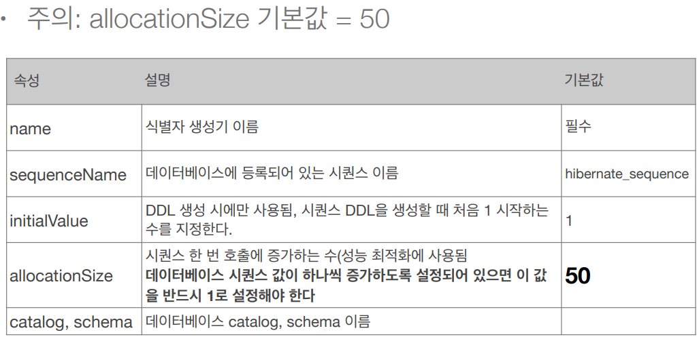

만약 `allocationSize=1`인 상태로 여러 새로운 객체들을 `em.persist` 하면 계속 db와 통신하며 sequence값을 받아야 한다. 하지만 `allocationSize=50` 으로 하면 미리 받아와서 쓴다. 50~100 정도가 적절하다.

한 번 할당된 sequence 범위는 메모리 어딘가 저장되는 듯. 트랜잭션 닫고 다시 해도 순서 유지됨. 단, ddl 끄고 어플리케이션을 아예 다시 시작하면 52번부터 시작함.

```java
public static void main(String[] args) {
    emf = Persistence.createEntityManagerFactory("hello");

    makeDataDDL();
    makeDataDDL();
    makeDataDDL();

    emf.close();
}
```
```
Hibernate: 
    select
        next value for MEMBER_SEQ
Id: 52
Id: 53
```


#### TABLE
키 생성용 테이블 사용 (모든 db) - `@TableGenerator` 필요

```java
@Entity
@TableGenerator(
    name = "MEMBER_SEQ_GENERATOR",
    table = "MY_SEQUENCES",
    pkColumnValue = "MEMBER_SEQ", allocationSize = 1)
public class Member {
    @Id
    @GeneratedValue(strategy = GenerationType.TABLE,
            generator = "MEMBER_SEQ_GENERATOR")
    private Long id; 
}
```

```sql
create table MY_SEQUENCES (
    sequence_name varchar(255) not null,
    next_val bigint,
    primary key ( sequence_name )
)
```

위와 같이 그냥 테이블을 사용하므로 모든 데이터베이스에 적용 가능하나, 성능 단점이 있다.

`@TableGenerator` 속성들

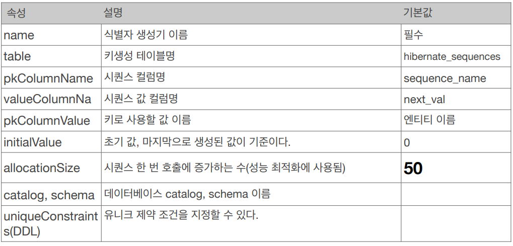

#### (기본값)AUTO
방언에 따라 자동 지정


# Section 5: 연관관계 매핑 기초

- 방향(Direction): 단방향, 양방향
- 다중성(Multiplicity): ManyToOne, OneToMany, OneToOne, ManyToMany
- 연관관계 주인(Owner)

테이블은 외래 키 조인을 통해 연관을 처리하므로 모든 것이 양방향이다. 
하지만 객체는 참조를 사용해서 연관을 처리하므로 단방향 매핑만 존재하며 이를 양쪽에서 사용하면 양방향 매핑이 된다. 이 때문에 관계의 주인이 생기게 되며 양방향 매핑은 고려할 게 많기 때문에 지양해야 한다. 

## 단방향 매핑

외래 키를 가진 애가 연관관계의 주인을 갖게 해야 한다. 비즈니스 로직으로 선택하면 안된다.

```java
public class Order {
    //    @Column(name = "MEMBER_ID")
    //    private Long memberId;
    @ManyToOne
    @JoinColumn(name = "MEMBER_ID") // column을 써준다.
    private Member member;
}
```

## 양방향 매핑

지양하자. 처음에 설계할 때는 단방향만 하고 JPQL이 복잡해진다면 그 때 추가하자. (양방향은 추가해도 테이블에 영향을 안준다.)

```java
public class Member {
    @Id @GeneratedValue @Column(name = "MEMBER_ID")
    private Long member;
    @OneToMany(mappedBy = "member") // 상대편의 field를 써준다.
    private List<Order> orders = new ArrayList<>(); // null ptr exception 방지용
}
```

`mappedBy` 를 사용하면 반대쪽에서 관계의 주인이라는 뜻이다. 
관계의 주인을 제외하고는 읽기만 된다. 단, 객체지향 관점에서 다음과 같은 일이 벌어지지 않도록 하려면:

```java
Member member1 = new Member();
em.persist(member1);

Order order1 = new Order();
order1.setMember(member1);
em.persist(order1);

System.out.println(member1.getOrders().size()); // 0
```

`member1` 를 가진 `order1` 을 만들었지만 `member1` 객체의 `orders` 에는 반영되지 않았다. (`setter`는 java 기본 규칙이 적용되는 method 이므로) `change` 라는 편의 method를 정의하자:

```java
public class Order {
    public void changeMember(Member member) {
        // 있던 것 삭제해주는 로직도 필요
        this.member = member;
        member.getOrders().add(this);
    }
}
```

편의 메소드 생성 시 무한 루프를 조심하자. (e.g. toString(), lombok, JSON 생성 라이브러리)
또한 위에서는 관계의 주인인 `order` 에 편의 메소드를 넣었지만, `member` 에 넣을 수도 있다.
단, 편의 메소드는 한 쪽에만 넣어야 나중에 헷갈리지 않는다. 설계 시 정하고 들어가자.

* 엔티티가 바뀔 것을 대비하여 controller에서는 절대 엔티티를 반환하지 말자. dto 사용하자.


# Section 6: 연관관계 매핑의 종류

- 다대일: @ManyToOne
- 일대다: @OneToMany - One 쪽에서 주인을 가지는 모델. 객체 설계시 이렇게 될 수 있으나, 쓰지 마세요
```java
public class Member {
    @OneToMany
    @JoinColumn(name = "ORDER_ID")
    private List<Order> orders = new ArrayList<>(); // 이제 주인이 member 다. 업데이트 시 쿼리가 여러 번 나간다.
}
```
- 일대일: @OneToOne - 가끔 쓴다 (방식은 ManyToOne 이랑 같음. db에 unique 조건이 걸린다.)

Member에서 주인을 할지, Locker에서 주인을 할지 결정해야 한다.

Member가 주인인 경우:

Member를 조회했을 때, `locker`가 lazy라면 프록시가 지연로딩을 처리해줘 Locker 테이블을 조회하지 않아도 된다. (값이 있는지 없는지만 볼거면)
```java
public class Member {
    @OneToOne
    @JoinColumn(name = "LOCKER_ID")
    private Locker locker;
}
```
```java
@Entity
public class Locker {
    @Id @GeneratedValue @Column(name = "LOCKER_ID")
    private Long id;
    @OneToOne(mappedBy = "locker")
    private Member member;
}
```

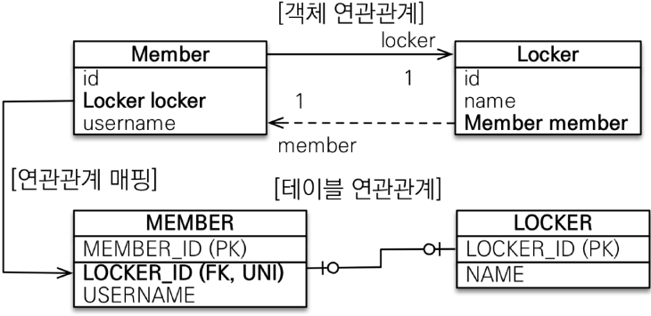


Locker가 주인인 경우:

Member를 조회했을 때, `locker`가 lazy라고 해도 어차피 Locker 테이블을 조회해야 하므로 항상 즉시 로딩된다.
```java
public class Member {
    @OneToOne(mappedBy = "member")
    private Locker locker;
}
```
```java
@Entity
public class Locker {
    @OneToOne
    @JoinColumn(name = "MEMBER_ID")
    private Member member;
}
```
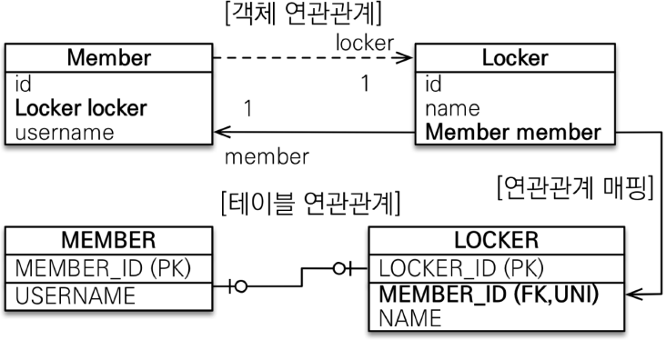


- 다대다: @ManyToMany - 쓰지 마세요


# Section 7: 고급 매핑

## 상속관계 매핑

관계형 데이터베이스는 상속 관계가 없다. 
다만 슈퍼타입 서브타입 관계 모델링 기법이 객체 상속과 유사하다.

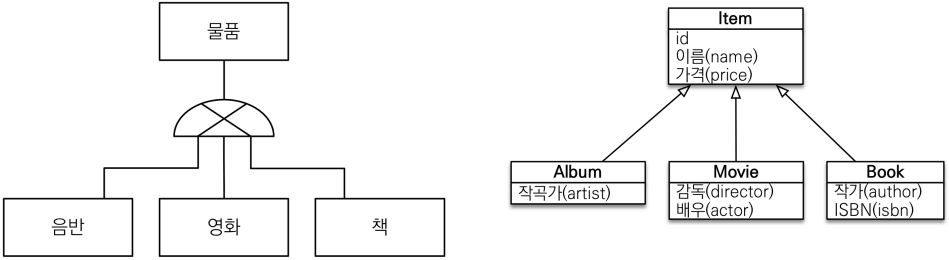

이를 구현하는 방법으로 아래의 3가지가 있다.

1. **조인 전략**: 각각 테이블로 변환

장점: 저장공간 효율, 외래 키 제약 활용

단점: 조회시 조인 많이 사용, 저장시 insert 두번
```java
@Entity
@Data
@Inheritance(strategy = InheritanceType.JOINED)
@DiscriminatorColumn(name = "DTYPE") // type 맞추기 위한 column
public class Item {
    @Id @GeneratedValue @Column(name = "ITEM_ID")
    private Long id;
    private String name;
    private int price;
}
```
```java
@Entity
@DiscriminatorValue("Movie") // type 맞추기 위한 column의 value
public class Movie extends Item {
    String director;
    String actor;
}
```

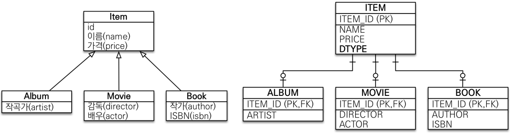

2. **단일 테이블 전략**: 통합 테이블로 변환

장점: 조회가 빠르다

단점: 자식 엔티티 컬럼은 nullable. 테이블이 너무 커지면 오히려 느려진다.

```java
@Inheritance(strategy=InheritanceType.SINGLE_TABLE)
```

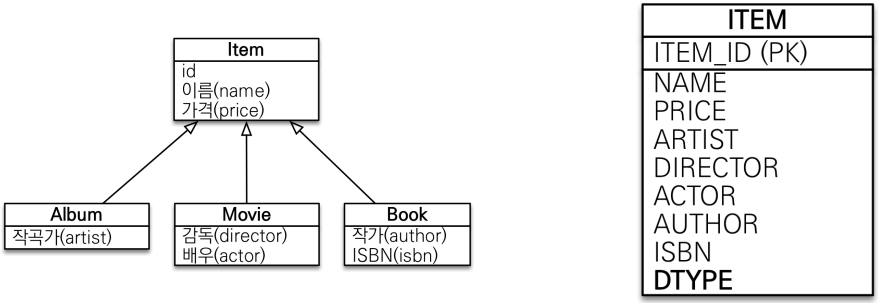

3. **구현 클래스마다 테이블 전략**: 서브타입 테이블로 변환 -> 쓰지 마세요

discriminator 필요 없음.

```java
@Inheritance(strategy=InheritanceType.TABLE_PER_CLASS) 
```

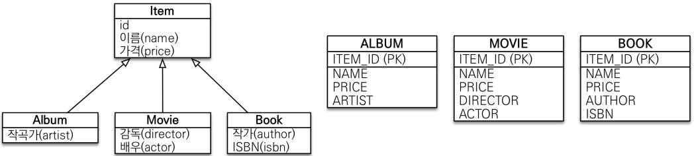


## @MappedSuperclass

공통 매핑 정보가 필요할 때 사용함. (id, name, updateDate, createDate 등)
엔티티가 아니므로 추상 클래스 권장.

```java
@Data
@MappedSuperclass
public abstract class BaseEntity {
    private String createdBy;
    private LocalDateTime createdDate;
    private String lastModifiedBy;
    private LocalDateTime lastModifiedDate;
}
```

```java
@Entity
@Table(name = "ORDERS")
@Data
public class Order extends BaseEntity {
    @Id
    @GeneratedValue
    @Column(name = "ORDER_ID")
    private Long id;
    ...
}
```
hibernate output:
```sql
create table ORDERS (
        DELIVERY_ID bigint unique,
        MEMBER_ID bigint,
        ORDER_ID bigint not null,
        createdDate timestamp(6),                   -- here
        lastModifiedDate timestamp(6),              -- here
        orderDate timestamp(6),
        createdBy varchar(255),                     -- here
        lastModifiedBy varchar(255),                -- here
        status varchar(255) check (status in ('ORDER','CANCEL')),
        primary key (ORDER_ID)
    )
```


# Section 8: 프록시와 연관관계 관리

## 프록시

`em.find()` 는 실제 엔티티 객체를 조회한다.
`em.getReference()` 는 프록시 엔티티 객체를 조회한다.
단, 영속성 컨텍스트에 이미 실제 엔티티 객체가 있으면 그것을 반환한다.
준 영속일 때 초기화를 시도하면 오류가 난다. (hibernate의 경우 `org.hibernate.LazyInitializationException`)
프록시는 바이트 조작으로 만들어졌으므로 `instance of` 사용해야 한다.

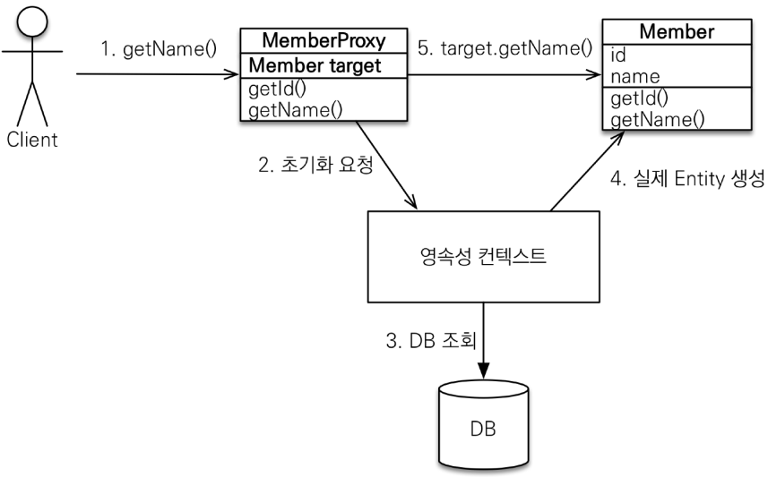

```java
Hibernate.initialize(order1); // 프록시 강제 초기화
emf.getPersistenceUnitUtil().isLoaded(order1); // 초기화 여부 확인
```

## 지연 로딩

```java
@Entity
    public class Member {
        @Id
        @GeneratedValue
        private Long id;
        @Column(name = "USERNAME")
        private String name;
        // FetchType.EAGER 는 쓰지 맙시다.
        @ManyToOne(fetch = FetchType.LAZY) // 단순 Member 조회 시 team join 없음
        @JoinColumn(name = "TEAM_ID")
        private Team team;
}
```
이후 `Team team = member.getTeam();` 하면 쿼리가 날라간다. 
즉시 로딩으로 떡칠되면 순환 오류 잡기 어려우니 필요할 때 JPQL fetch 조인이나, 엔티티 그래프 기능을 사용하자.

## CASCADE

특정 엔티티를 영속 상태로 만들 때 연관된 엔티티도 함께 영속 상태로 만들도 싶을 때 사용한다.
영속성 전이는 연관관계를 매핑하는 것과 아무 관련이 없다.
엔티티를 영속화할 때 연관된 엔티티도 함께 영속화하는 편리함을 제공할 뿐이다.

다음의 옵션들이 있지만 앞의 3개를 주로 쓴다.

ALL: 모두 적용 / PERSIST: 영속 / REMOVE: 삭제 / MERGE: 병합 / REFRESH / DETACH

```java
@Data
@Entity
public class Parent {
    @Id @GeneratedValue @Column(name = "PARENT_ID")
    private Long id;
    private String name;
    @OneToMany(mappedBy = "parent", cascade = CascadeType.ALL)
    private List<Child> childList = new ArrayList<>();

    public void addChild(Child child) {
        childList.add(child);
        child.setParent(this);
    }
}
```

```java
@Data
@Entity
public class Child {
    @Id
    @GeneratedValue
    private Long id;
    private String name;
    @ManyToOne
    @JoinColumn(name = "PARENT_ID")
    private Parent parent;
}
```

```java
Parent parent = new Parent();
parent.setName("a");
em.persist(parent);

Child child1 = new Child();
child1.setName("c1");
Child child2 = new Child();
child2.setName("c2");

parent.addChild(child1);
parent.addChild(child2);

em.flush();
em.clear();

Parent parent1 = em.find(Parent.class, parent.getId());
for (Child child : parent1.getChildList()) {
    System.out.println(child.getName());
}
```
```bash
Hibernate: 
    /* insert for
        jpashop.domain.cascade.Child */insert 
    into
        Child (name, PARENT_ID, id) 
    values
        (?, ?, ?)
Hibernate: 
    /* insert for
        jpashop.domain.cascade.Child */insert 
    into
        Child (name, PARENT_ID, id) 
    values
        (?, ?, ?)
...
c1
c2
```


## orphanRemoval

부모 엔티티와 연관관계가 끊어진 자식 엔티티를 자동으로 삭제한다.
참조하는 곳이 하나일 때 사용해야한다. 즉, 특정 엔티티가 개인 소유할 때 사용한다.
@OneToOne, @OneToMany만 가능.

```java
public class Parent {
    ...
    @OneToMany(mappedBy = "parent", cascade = CascadeType.ALL, orphanRemoval = true)
    private List<Child> childList = new ArrayList<>();
```
```java
parent.getChildList().remove(0);
```
```bash
Hibernate: 
    /* delete for jpashop.domain.cascade.Child */delete 
    from
        Child 
    where
        id=?
```

위와 같이 `CascadeType.ALL` + `orphanRemoval=true` 하면 부모 엔티티를 통해서 자식의 생명 주기를 관리하게 된다.
DDD의 Aggregate Root 개념을 구현할 때 유용하다.


# Section 9: 값 타입

객체들은 주소로 관리되며 저장될 때는 값이 읽어져 들어감을 기억하면 된다.

값 타입은 정말 값 타입이라 판단될 때만 사용한다.
엔티티와 값 타입을 혼동해서 엔티티를 값 타입으로 만들면 안된다.
식별자가 필요하고, 지속해서 값을 추적, 변경해야 한다면 그것은 값 타입이 아닌 엔티티이다.

JPA의 데이터 타입
- 엔티티 타입
- 값 타입
  - 기본값 타입
    - 자바 기본 타입: int, double
    - 래퍼 클래스: Integer, Long
    - String
  - 임베디드 타입 (복합)
  - 컬렉션 값 타입

## 임베디드 타입

객체와 테이블을 아주 세밀하게(find-grained) 매핑하는 것이 가능하다.
잘 설계한 ORM 애플리케이션은 매핑한 테이블의 수보다 클래스의 수가 더 많다.

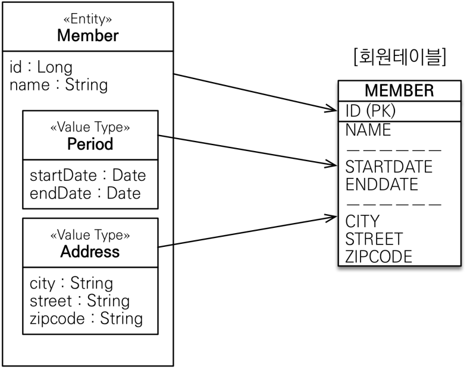

```java
@Getter
@Embeddable
public class Address {
    private String city;
    private String street;
    private String zipcode;
}
```

```java
@Getter
@Embeddable
public class Period {
    private LocalDateTime startDate;
    private LocalDateTime endDate;
}
```

```java
public class Member {
    @Embedded
    private Period workPeriod;
    @Embedded
    @AttributeOverrides({ // 밑의 필드랑 겹치니까 다른걸로 바꿔줌
            @AttributeOverride(name = "city",
                    column = @Column(name = "WORK_CITY")
            ),
            @AttributeOverride(name = "street",
                    column = @Column(name = "WORK_STREET")
            ),
            @AttributeOverride(name = "zipcode",
                    column = @Column(name = "WORK_ZIPCODE")
            )
    })
    private Address workAddress;

    private String city;
    private String street;
    private String zipcode;
    ...
}
```
```bash
create table Member (
    endDate timestamp(6),
    startDate timestamp(6),
    WORK_CITY varchar(255),
    WORK_STREET varchar(255),
    WORK_ZIPCODE varchar(255),
    city varchar(255),
    street varchar(255),
    zipcode varchar(255)
)
```

참고로 임베디드 타입의 값이 null이면 매핑한 컬럼 값은 모두 null이다.

Integer, String 처럼 객체 타입을 수정할 수 없게 만들면 부작용
(같은 객체가 여러 곳에서 쓰이다가 누가 값을 바꾼 경우 다른애들도 영향을 받음)
을 원천 차단할 수 있다. 
즉, 임베디드 타입은 immutable 로 설계한다. 
위에 `@Getter` 만 붙은 것을 볼 수 있다. 

동등성 비교를 위해 `equals` 를 정의하는 것이 좋다. (intellij의 generate를 이용하자)


## 컬렉션 값 타입

값 타입은 정말 값 타입이라 판단될 때만 사용한다. 왠만하면 일대다 관계를 쓰는게 편해보인다.
일대다 관계에 Cascade + orphanRemoval 해서 모델링하는게 편할듯.

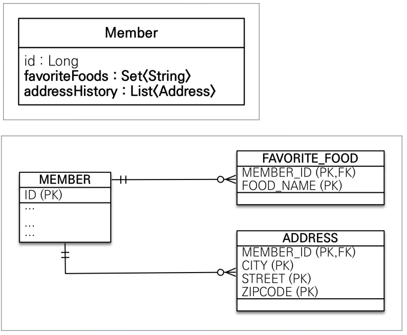

```java
@Data
public class Member {
    @Id
    @GeneratedValue
    @Column(name = "MEMBER_ID")
    private Long member;
    ...
    @ElementCollection
    @CollectionTable(name = "FAVORITE_FOODS", joinColumns = @JoinColumn(name = "MEMBER_ID")) // 상대 테이블의 정보
    @Column(name = "FOOD_NAME") // 상대 테이블의 정보
    private Set<String> favoriteFoods = new HashSet<>();
    @ElementCollection
    @CollectionTable(name = "ADDRESS", joinColumns = @JoinColumn(name = "MEMBER_ID")) // 상대 테이블의 정보
    private List<Address> addressHistory = new ArrayList<>();
}
```
```bash
Hibernate: 
    create table FAVORITE_FOODS (
        MEMBER_ID bigint not null,
        FOOD_NAME varchar(255)
    )
Hibernate: 
    create table ADDRESS (
        MEMBER_ID bigint not null,
        city varchar(255),
        street varchar(255),
        zipcode varchar(255)
    )
```
`member` 쪽은 바뀌지 않음. (one to many랑 유사) 

```java
Member member1 = new Member();
member1.getFavoriteFoods().add("A");
member1.getFavoriteFoods().add("B");

Member member2 = new Member();
member2.getFavoriteFoods().add("A");
member2.getFavoriteFoods().add("B");

em.persist(member1);
em.persist(member2);
```

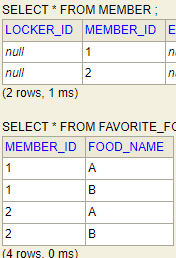

위처럼 저장되는 것을 볼 수 있다. 단, 삭제 및 수정 시 equals 를 잘 정의해 놓아야 한다.

```java
Member member1 = new Member();
member1.getAddressHistory().add(new Address("city", "street", "zipcode"));
member1.getAddressHistory().add(new Address("city", "street", "zipcode"));

Member member2 = new Member();
member2.getAddressHistory().add(new Address("city", "street", "zipcode"));
member2.getAddressHistory().add(new Address("city", "street", "zipcode"));

em.persist(member1);
em.persist(member2);

em.flush();
em.clear();

em.find(Member.class, member1.getMember()).getAddressHistory().remove(0);
```

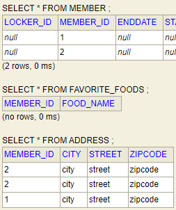

이건 또 뭐냐? 싶은데, 그냥 맞는 애 하나만 지우는듯. 
아니면 애초에 db 구성할 때 모든 컬럼 묶어서 키로 구성해줘야 하는듯.
마지막 `remove`부분 쿼리만 보면 다음과 같다.

```bash
Hibernate: 
    /* one-shot delete for jpashop.domain.Member.addressHistory */delete 
    from
        ADDRESS 
    where
        MEMBER_ID=?
Hibernate: 
    /* insert for
        jpashop.domain.Member.addressHistory */insert 
    into
        ADDRESS (MEMBER_ID, city, street, zipcode) 
    values
        (?, ?, ?, ?)
```

값 타입 컬렉션에 변경 사항이 발생하면, 주인 엔티티와 연관된 모든 데이터를 삭제하고, 값 타입 컬렉션에 있는 현재 값을 모두 다시 저장한다. 
`@OrderColumn` 으로 해결할 수 있긴 한데, 굳이굳이다.


