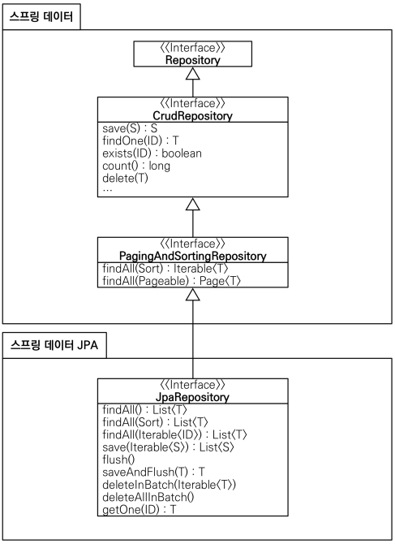

간단한 것만 메소드 이름으로 쿼리 생성 하고, 복잡한 건 querydsl로 처리하자.
추가 기능들은 인터페이스 구현 방식으로 처리하되, view와 관련된 조회쿼리는 아예 다른 repository로 분리할 것을 권장한다.

# Section 3: 공통 인터페이스 기능



- 제네릭 타입
  - T : 엔티티
  - ID : 엔티티의 식별자 타입
  - S : 엔티티와 그 자식 타입
- 주요 메서드
  - save(S) : 새로운 엔티티는 저장하고 이미 있는 엔티티는 병합한다.
  - delete(T) : 엔티티 하나를 삭제한다. 내부에서 EntityManager.remove() 호출
  - findById(ID) : 엔티티 하나를 조회한다. 내부에서 EntityManager.find() 호출
  - getOne(ID) : 엔티티를 프록시로 조회한다. 내부에서 EntityManager.getReference() 호출
  - findAll(…) : 모든 엔티티를 조회한다. 정렬( Sort )이나 페이징( Pageable ) 조건을 파라미터로 제공할 수 있다.

`org.springframework.data.jpa.repository.JpaRepository` 를 구현한
`org.springframework.data.jpa.repository.support.SimpleJpaRepository` 를 보면
이러한 method들이 `EntityManager` 이용해서 구현되어 있다.
또한 기본적으로 `@Transactional(readOnly = true)` 으로 걸려있는데,
`delete`, `update` method 들은 개별 `@Transactional` 으로 걸려있다.


# Section 4: 쿼리 메소드 기능

메소드 이름으로 쿼리 생성, JPA NamedQuery 호출, 어노테이션 방식 의 3가지가 있으나 namedQuery는 쓰지 말자.

반환 타입을 알아서 맞춰 준다는 것도 큰 장점이다.

## 메소드 이름으로 쿼리 생성

https://docs.spring.io/spring-data/jpa/reference/jpa/query-methods.html

```java
public interface MemberRepository extends JpaRepository<Member, Long> {
    List<Member> findByUsernameAndAgeGreaterThan(String username, int age);
}
```

- 조회: find…By ,read…By ,query…By get…By,
  - find 와 By 사이에 뭐든 들어가도 된다. findHelloBy 처럼 ...에 식별하기 위한 내용(설명)이 들어가도 된다.
- COUNT: count…By 반환타입 long
- EXISTS: exists…By 반환타입 boolean
- 삭제: delete…By, remove…By 반환타입 long
- DISTINCT: findDistinct, findMemberDistinctBy
- LIMIT: findFirst3, findFirst, findTop, findTop3


## @Query

```java
public interface MemberRepository extends JpaRepository<Member, Long> {
    @Query("select m from Member m where m.username= :username and m.age = :age")
    List<Member> findUser(@Param("username") String username, @Param("age") int age);

    @Query("select new study.datajpa.dto.MemberDto(m.id, m.username, t.name) from Member m join m.team t")
    List<MemberDto> findMemberDto();
}
```


## 페이징

하이버네이트 6에서는 무의미한 left join을 최적화 해준다. 다만 countQuery 분리를 알아는 두자.
```java
public interface MemberRepository extends JpaRepository<Member, Long> {
  @Query(value = "select m from Member m left join m.team t", 
          countQuery = "select count(m) from Member m")
  Page<Member> findMemberAllCountBy(Pageable pageable);
}
```
앱의 무한 페이지 구현하려면 `Slice` 쓰자.

## 벌크 업데이트

왠만하면 업데이트를 먼저 치고 조회를 하자.
```java
public interface MemberRepository extends JpaRepository<Member, Long> {
  @Modifying(clearAutomatically = true) // 기본 false. em.clear() 하는 옵션이다.
  @Query("update Member m set m.age = m.age + 1 where m.age >= :age")
  int bulkAgePlus(@Param("age") int age);
}
```

## @EntityGraph

패치 조인이다의 간편 버전으로, LEFT OUTER JOIN 을 사용한다.

```java
public interface MemberRepository extends JpaRepository<Member, Long> {
  //공통 메서드 오버라이드
  @Override
  @EntityGraph(attributePaths = {"team"})
  List<Member> findAll();
  //JPQL + 엔티티 그래프
  @EntityGraph(attributePaths = {"team"})
  @Query("select m from Member m")
  List<Member> findMemberEntityGraph();
  //메서드 이름으로 쿼리에서 특히 편리하다.
  @EntityGraph(attributePaths = {"team"})
  List<Member> findByUsername(String username);
}
```

